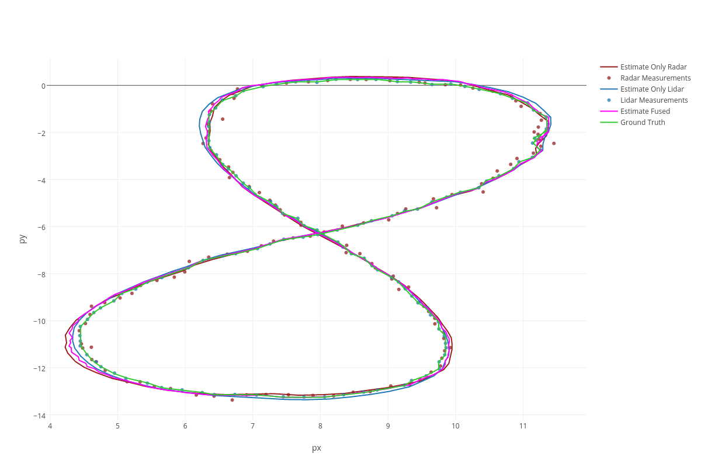
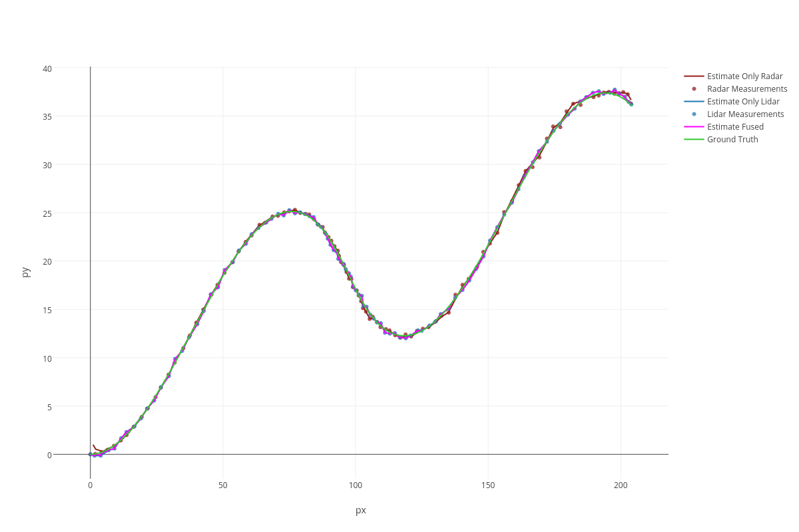
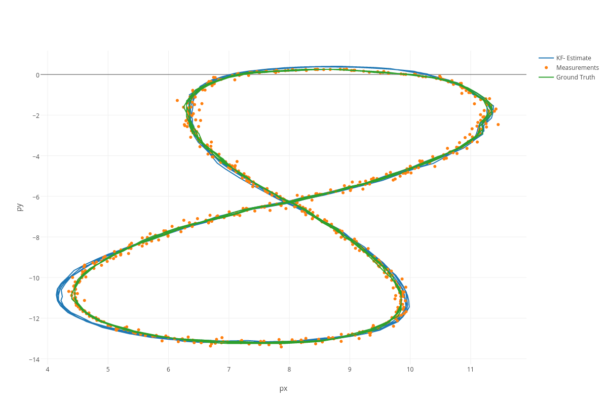
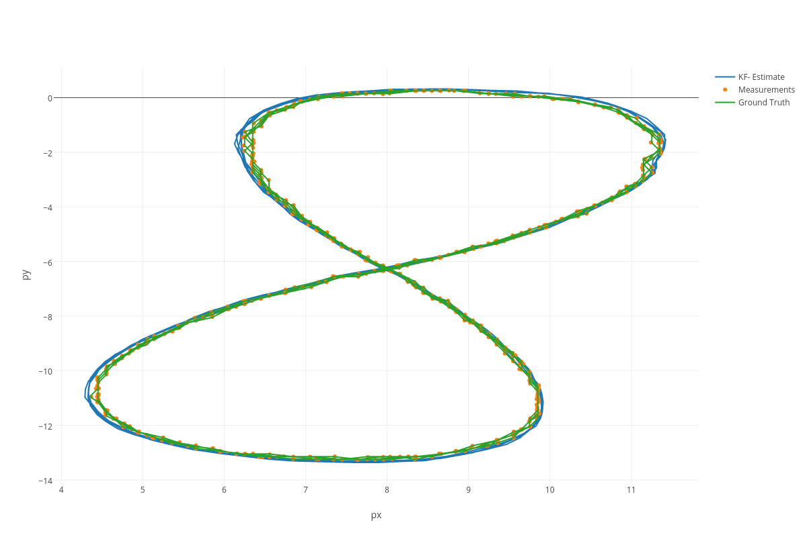
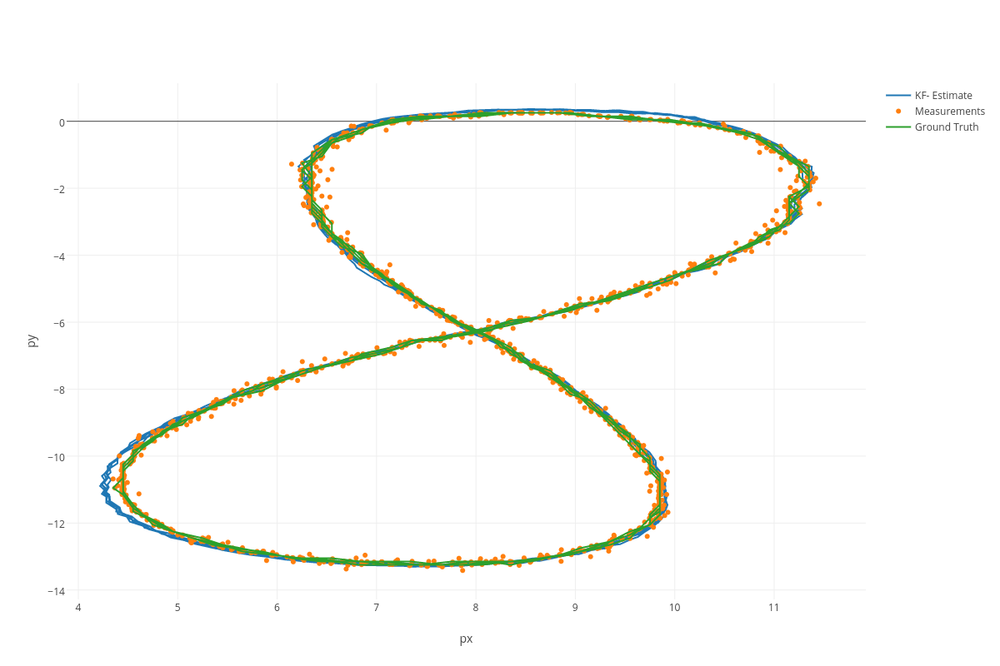
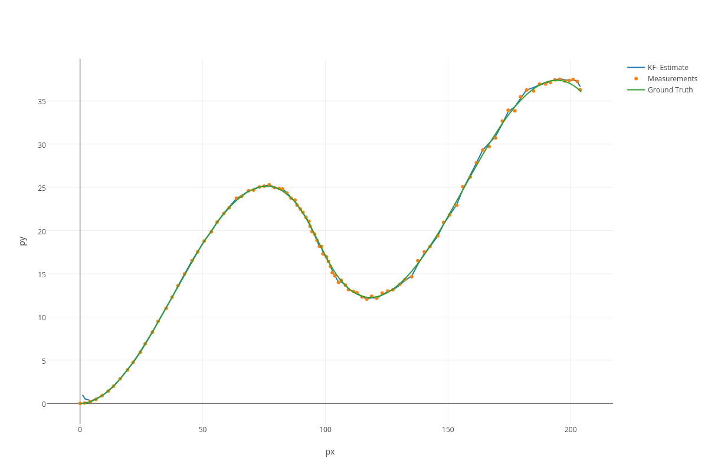
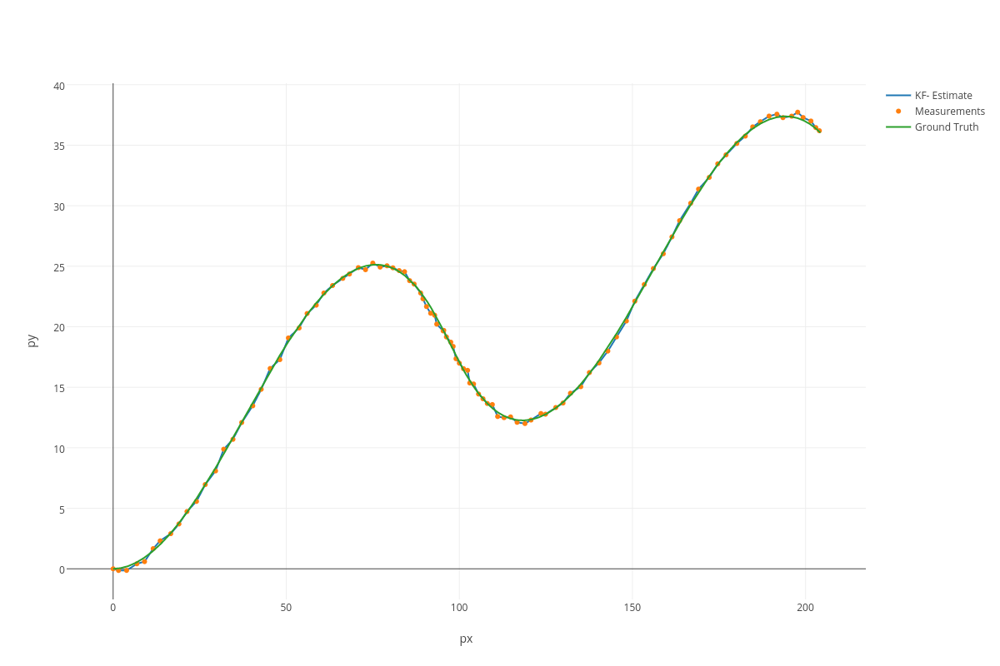
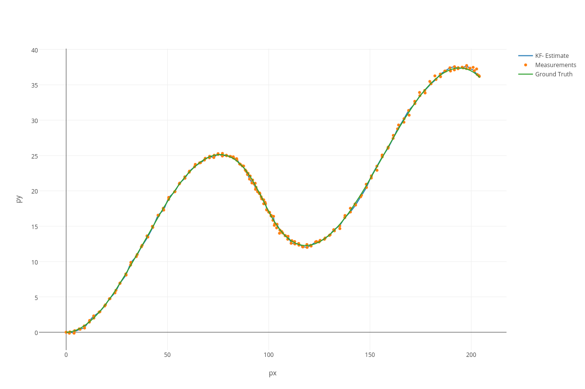

# Extended-Kalman-Filter
Implementation of an extended Kalman filter to fuse lidar and radar sensor data.

## Usage
```
Input and Output files are required

Usage:
  /Extended_Kalman_Filter [OPTION...] positional parameters

  -h, --help        Print help
  -i, --input arg   Input File
  -o, --output arg  Output file
  -v, --verbose     verbose flag
  -r, --radar       use only radar data
  -l, --lidar       use only lidar data
```

## Results


| Input file 1  | Input file 2  |
| ------------- |:-------------|
|     |  |

### Input file 1

| Input file 1 - Radar       | RMSE                                                      |
| -------------------------- |:----------------------------------------------------------|
|  | px=0.10121<br>py=0.0823314<br>vx=0.613423<br>vy=0.581877  |

| Input file 1 - Lidar       | RMSE                                                      |
| -------------------------- |:----------------------------------------------------------|
|  | px=0.0681865<br>py=0.0572297<br>vx=0.625587<br>vy=0.560902|

| Input file 1 - Fused       | RMSE                                                      |
| -------------------------- |:----------------------------------------------------------|
|      | px=0.0651649<br>py=0.0605378<br>vx=0.54319<br>vy=0.544191 |

### Input file 2

| Input file 2 - Radar       | RMSE                                                      |
| -------------------------- |:----------------------------------------------------------|
|  | px=0.186346<br>py=0.232926<br>vx=0.131597<br>vy=0.206269  |

| Input file 2 - Lidar       | RMSE                                                      |
| -------------------------- |:----------------------------------------------------------|
|  | px=0.217995<br>py=0.194325<br>vx=0.93745<br>vy=0.833882   |

| Input file 2 - Fused       | RMSE                                                      |
| -------------------------- |:----------------------------------------------------------|
|      | px=0.185496<br>py=0.190302<br>vx=0.476754<br>vy=0.804469  |